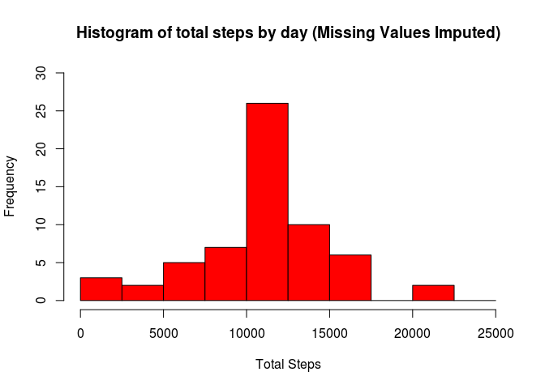
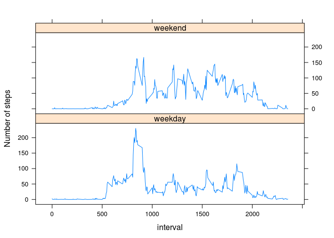

# Reproducible Research: Peer Assessment 1


```r
library(knitr)
library(lattice)
```

## Loading and preprocessing the data


```r
myDataf <- read.csv(unz("./activity.zip", "activity.csv"), header = TRUE,
                    colClasses = c("integer", "Date", "numeric"), sep = ",",
                    na.strings = "NA", quote = "\"")
myDataf$id <- 1:nrow(myDataf) #creates id column. will help order later
```

## What is mean total number of steps taken per day?

Histogram of the total number of steps taken each day


```r
myDataf.steps <- aggregate(steps ~ date, myDataf, sum)
head(myDataf.steps)
```

```
##         date steps
## 1 2012-10-02   126
## 2 2012-10-03 11352
## 3 2012-10-04 12116
## 4 2012-10-05 13294
## 5 2012-10-06 15420
## 6 2012-10-07 11015
```

```r
with(myDataf.steps, hist(steps,breaks=seq(from=0, to=25000, by=2500),
                    ylim = c(0,30),xlab = "Total Steps",
                    col="red", main = "Histogram of total steps by day"))
```

<!-- -->

Mean and median number of steps taken each day

```r
mean(myDataf.steps$steps, na.rm = TRUE)
```

```
## [1] 10766.19
```

```r
median(myDataf.steps$steps, na.rm = TRUE)
```

```
## [1] 10765
```

## What is the average daily activity pattern?

Time series plot of the average number of steps taken

```r
myDataf.steps.average <- aggregate(steps ~ interval, myDataf, mean)
with(myDataf.steps.average, 
                    plot(interval, steps, type = "l",
                    xlab = "Interval", ylab = "Average Steps", col = "red",
                    main = "Average number of steps taken"))
```

<!-- -->

The 5-minute interval that, on average, contains the maximum number of steps

```r
myDataf.steps.average[which.max(myDataf.steps.average$steps),]
```

```
##     interval    steps
## 104      835 206.1698
```


## Imputing missing values

### Code to describe and show a strategy for imputing missing data  
1. Calculate total number of missing values in the dataset 

```r
NA.list <- is.na(myDataf$steps)
sum(NA.list)
```

```
## [1] 2304
```

2. Strategy for filling in all of the missing values in the dataset:  
We will fill in all missing NAs with the average number of steps in the same 5-min interval

3. New Dataset with missing data filled


```r
myDataf.filled <- merge(myDataf[NA.list,], 
                        myDataf.steps.average, by="interval", sort = F) #adds means column 2 NAs subset
myDataf.filled$steps <- myDataf.filled$steps.y                          #adds new value to NAs
myDataf.filled$steps.x <- NULL; myDataf.filled$steps.y <- NULL          #drops extra columns
myDataf.filled <- rbind(myDataf.filled,myDataf[!is.na(myDataf$steps),]) #adds non NAs entries
myDataf.filled <-  myDataf.filled[order(myDataf.filled$id), ]           #re-order
myDataf.filled$id <- NULL                                               #drops id column
head(myDataf.filled)                                                    #shows new data
```

```
##    interval       date     steps
## 1         0 2012-10-01 1.7169811
## 10        5 2012-10-01 0.3396226
## 17       10 2012-10-01 0.1320755
## 29       15 2012-10-01 0.1509434
## 33       20 2012-10-01 0.0754717
## 45       25 2012-10-01 2.0943396
```

4. Histogram of the total number of steps taken each day after missing values are imputed. Calculate and report the mean and median total number of steps taken per day

```r
myDataf.filled.steps <- aggregate(steps ~ date, myDataf.filled, sum)
head(myDataf.filled.steps)
```

```
##         date    steps
## 1 2012-10-01 10766.19
## 2 2012-10-02   126.00
## 3 2012-10-03 11352.00
## 4 2012-10-04 12116.00
## 5 2012-10-05 13294.00
## 6 2012-10-06 15420.00
```

```r
with(myDataf.filled.steps, hist(steps,breaks=seq(from=0, to=25000, by=2500),
                    ylim = c(0,30), xlab = "Total Steps",
                    col="red", main = "Histogram of total steps by day (Missing Values Imputed)"))
```

<!-- -->

```r
mean(myDataf.filled.steps$steps, na.rm = TRUE)
```

```
## [1] 10766.19
```

```r
median(myDataf.filled.steps$steps, na.rm = TRUE)
```

```
## [1] 10766.19
```
 As a result of the method used to fill in the invalid data, the calculated mean after imputation of the new values has not changed (10766,19). On the other hand, the median did change (10765 -> 10766,19), equating to the mean.
 
## Are there differences in activity patterns between weekdays and weekends?

1. Create a new factor variable in the dataset with two levels – “weekday” and “weekend” indicating whether a given date is a weekday or weekend day.


```r
myDataf.filled$weekday <- as.factor(
                          ifelse(as.POSIXlt(myDataf.filled$date)$wday %in% c(0,6),
                          "weekend","weekday"))
```

2. Make a panel plot containing a time series plot (i.e. type = "l") of the 5-minute interval (x-axis) and the average number of steps taken, averaged across all weekday days or weekend days (y-axis).


```r
myDataf.filled.average <- aggregate(steps ~ interval + weekday, myDataf.filled, mean)
xyplot(steps ~ interval | weekday, data = myDataf.filled.average, 
       layout = c(1, 2), type='l', ylab = "Number of steps")
```

<!-- -->

